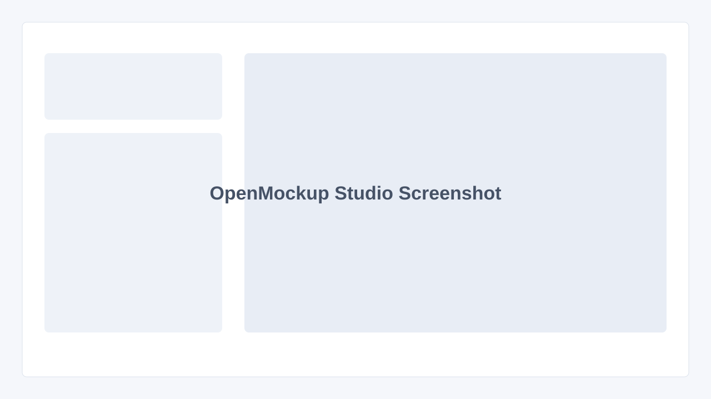

# OpenMockup Studio

OpenMockup Studio is a local bulk mockup app for small e-commerce sellers. PSD mockups and design files stay in the browser, are processed through an embedded Photopea iframe, and are exported as PNG files inside a ZIP.



## MVP Features

- Upload a PSD mockup
- Upload multiple PNG/JPG designs
- Enter the smart object layer name
- Adjust placement with percentage values, rotation, opacity, fit mode, and anchor
- Generate a single preview
- Export all designs as a ZIP batch
- Save and load presets as JSON

## Start

```bash
npm install
npm run dev
```

The app runs locally in the browser. No backend server is required for image processing; Vite is only used for local development.

## Folder Structure

```text
src/
  components/
  lib/
    export/
    photopea/
  types/
```

## Workflow

1. Upload a PSD mockup.
2. Upload one or more PNG/JPG designs.
3. Enter the smart object layer name.
4. Adjust placement.
5. Use "Generate Preview" for a test run.
6. Use "Export Batch" to create one PNG per design and download all results as a ZIP.

## Photopea Notes

OpenMockup Studio uses Photopea's public API through `postMessage`. The Photopea iframe is kept offscreen, but it still loads at a real size because Photopea is more reliable that way than inside a tiny hidden frame.

## GIF Placeholder


## MVP Limits

- Smart object replacement requires the named layer to exist in the PSD.
- PSD files with deeply nested layers or locked smart objects may need additional handling.
- Batch processing runs serially on purpose so Photopea remains stable and the browser is not overloaded.
