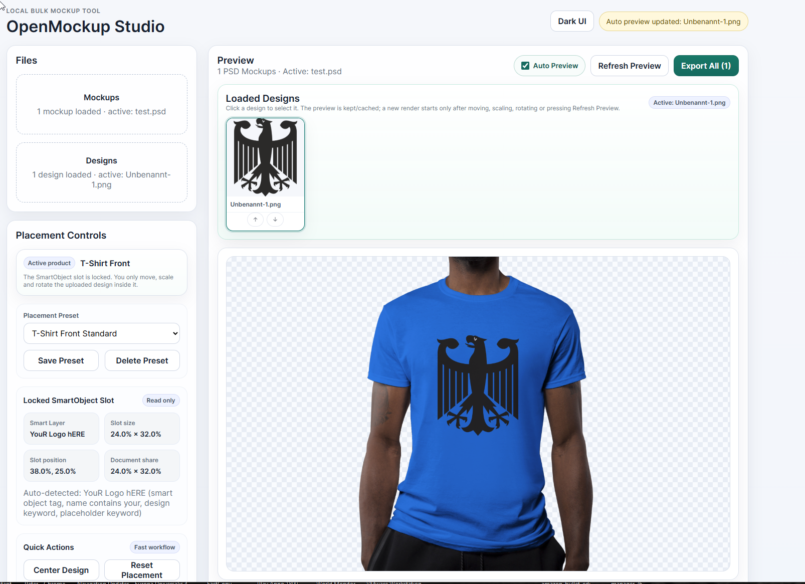

# OpenMockup Studio

OpenMockup Studio is a browser-based bulk mockup tool for small e-commerce sellers, print shops, artists and convention vendors.

It lets you load PSD mockups or flat image mockups, place multiple designs, preview the result and export complete PNG/JPG/WebP mockup batches as ZIP files.

Image mockups are rendered locally in the browser with Canvas. PSD SmartObject rendering uses an embedded Photopea iframe and a temporary design asset endpoint so Photopea can load the selected design.



---

## Features

* Upload one or more PSD, PNG, JPG or WebP mockups
* Upload multiple PNG, JPG or WebP designs
* Select mockups and designs with clickable thumbnails
* Visual placement editor for moving, scaling and rotating designs
* Smart preview cache to avoid unnecessary re-rendering
* Per-mockup placement settings
* Product profiles for common print products
* Export profiles for marketplaces and social media formats
* Batch export all mockup/design combinations as a ZIP
* Optional crop, resize, watermark and format conversion
* Preset save/load as JSON
* Light and dark UI
* PSD SmartObject replacement through Photopea
* Local image mockup rendering without external services

---

## Current status

OpenMockup Studio is a release-ready Vite/React app designed for local use, temporary public tunnel use or VPS hosting.

| Mode                       | Static hosting / GitHub Pages | Local or VPS server |
| -------------------------- | ----------------------------- | ------------------- |
| PNG/JPG/WebP image mockups | Yes                           | Yes                 |
| PSD SmartObject rendering  | No                            | Yes                 |
| Batch ZIP export           | Yes for image mockups         | Yes                 |
| Photopea asset endpoint    | No                            | Yes                 |

GitHub Pages can host the static UI, but PSD mode needs a real server because Photopea must fetch temporary uploaded design assets through the `__openmockup/design` endpoint.

For full PSD support, use local development, `npm run preview`, `npm run dev:public`, a VPS, Vercel/Netlify functions or another small backend.

---

## Privacy note

Image mockups are rendered locally in your browser with Canvas.

PSD SmartObject rendering uses Photopea, which is loaded in an iframe. The selected design asset is temporarily exposed through a public HTTPS URL when using the Cloudflare Tunnel workflow, so Photopea can fetch it.

Do not use PSD mode with confidential files unless you understand this workflow.

Runtime design assets are temporary and are not intended to be stored permanently by OpenMockup Studio.

---

## Photopea disclaimer

OpenMockup Studio is not affiliated with Photopea.

PSD rendering depends on Photopea's public iframe/API behavior. If Photopea changes its API or iframe behavior, PSD SmartObject rendering may need updates.

---

## Requirements

* Node.js 20 or newer
* npm 10 or newer
* A modern Chromium, Firefox or Safari browser
* Optional: `cloudflared` for temporary public HTTPS asset URLs in PSD mode

---

## Windows one-click start

For non-technical Windows users, the release includes helper files in the project root:

```text
start.bat         Full PSD/Photopea mode with temporary HTTPS asset tunnel
start-local.bat   Local image mockup mode without public tunnel
stop.bat          Stop local server and tunnel
```

Double-click `start.bat` to start OpenMockup Studio in full PSD/Photopea mode.

The script checks for Node.js, npm and `cloudflared`, tries to install missing tools with `winget`, installs project dependencies with `npm install` when needed, starts a temporary Cloudflare Tunnel, starts the local Vite server and opens the app locally at:

```text
http://127.0.0.1:5173
```

The Cloudflare Tunnel URL is only used as a public HTTPS asset URL for Photopea. The app UI itself opens locally.

You do not need to open or bookmark the `trycloudflare.com` URL.

Keep the `start.bat` terminal window open while using PSD mode.

---

## Local image-only mode

Use `start-local.bat` if you only want to work with PNG, JPG or WebP mockups.

This mode does not start a public tunnel.

It is enough for:

* Flat PNG/JPG/WebP mockups
* Canvas-based previews
* Local batch ZIP exports

PSD/Photopea mode will show a public HTTPS URL warning when used without a tunnel or public server.

---

## Stop the app

Double-click:

```text
stop.bat
```

This stops the local Vite server and the Cloudflare Tunnel.

You can also stop the app by closing the `start.bat` terminal window.

---

## Optional Windows settings

Use a custom port:

```bat
set OPENMOCKUP_PORT=5180
start.bat
```

Use a different Cloudflare Tunnel protocol:

```bat
set OPENMOCKUP_TUNNEL_PROTOCOL=quic
start.bat
```

The default tunnel protocol is `http2` because it is usually more reliable on Windows networks that block or throttle UDP/QUIC.

---

## Troubleshooting PSD / Photopea mode

### Photopea says it needs a public HTTPS design URL

Use:

```text
start.bat
```

Do not use `start-local.bat` for PSD mode.

Photopea cannot fetch design assets from `127.0.0.1`, so it needs a temporary public HTTPS asset URL.

---

### Browser shows `DNS_PROBE_FINISHED_NXDOMAIN` for a `trycloudflare.com` URL

You are probably opening the temporary tunnel URL directly.

The app should be opened locally:

```text
http://127.0.0.1:5173
```

Recommended reset:

```bat
stop.bat
start.bat
```

Do not bookmark old `trycloudflare.com` URLs. They expire as soon as the tunnel stops.

---

### Runtime files

The Windows launcher may create these temporary files while the app is running:

```text
.openmockup-pids.bat
.openmockup-public-url.txt
.openmockup-public.log
```

These files are ignored by Git.

---

## Quick start for developers

Install dependencies:

```bash
npm install
```

Start the local development server:

```bash
npm run dev
```

Open the URL printed by Vite, usually:

```text
http://127.0.0.1:5173
```

---

## Public development mode for PSD/Photopea

Start the app with a temporary public Cloudflare Tunnel:

```bash
npm run dev:public
```

The app opens locally, while the public HTTPS tunnel is used internally for Photopea asset loading.

---

## Production build

Create a production build:

```bash
npm run build
```

Preview the production build locally:

```bash
npm run preview
```

The preview server includes the temporary design endpoint required for PSD/Photopea mode.

For Photopea to access that endpoint outside localhost, it must be reachable through HTTPS.

---

## VPS hosting

OpenMockup Studio can be hosted on a Linux VPS behind Nginx, Caddy, CloudPanel or another reverse proxy.

Example environment:

```bash
OPENMOCKUP_PUBLIC_BASE_URL=https://openmockup.example.com
OPENMOCKUP_MAX_DESIGN_MB=50
OPENMOCKUP_DESIGN_TTL_MS=1800000
```

Then run:

```bash
npm install
npm run build
npm run preview
```

Keep the Vite preview server bound to localhost and proxy your domain to it.

Example reverse proxy target:

```text
http://127.0.0.1:4173
```

---

## Useful scripts

```bash
npm run dev              # Start local development server
npm start                # Start local server on http://127.0.0.1:5173
npm run dev:public       # Start with Cloudflare Tunnel for PSD/Photopea assets
npm run build            # Type-check and build production assets
npm run preview          # Preview production build with design endpoint
npm run typecheck        # Run TypeScript checks
npm run typecheck:strict # TypeScript checks with unused-code detection
npm run clean            # Remove generated folders such as dist and node_modules
```

---

## Workflow

1. Upload one or more mockups.
2. Upload one or more designs.
3. Select a mockup and a design.
4. Move, scale or rotate the design in the visual editor.
5. Click **Refresh Preview** or keep **Auto Preview** enabled.
6. Export all combinations as a ZIP.

---

## Notes about PSD mockups

* The SmartObject layer should already exist in the PSD.
* Deeply nested, locked or unusual SmartObjects may need manual layer naming or PSD cleanup.
* PSD batches are intentionally processed serially to keep Photopea stable.
* Photopea is only loaded when at least one PSD mockup is present.
* PNG/JPG/WebP mockups do not require Photopea.

---

## Repository hygiene

The release package intentionally excludes:

```text
node_modules/
dist/
local PSD test files
ZIP exports
temporary output folders
runtime tunnel files
```

Install dependencies locally after cloning:

```bash
npm install
```

---

## Roadmap

Planned or recommended future improvements:

* Four-point perspective transform for flat image mockups
* Better mask support for PNG/JPG/WebP mockups
* Drag-and-drop design ordering
* Per-product default placement presets
* Optional self-hosted asset server for PSD mode
* More advanced product profiles
* Faster batch preview generation
* Better error recovery for failed PSD exports
* Optional user authentication for VPS hosting

---

## Contributing

Issues and pull requests are welcome.

Before submitting changes, please run:

```bash
npm run typecheck:strict
npm run build
```

Please keep release packages clean and do not commit:

```text
node_modules/
dist/
temporary exports
private PSD files
local runtime logs
```

---

## License

MIT License.
